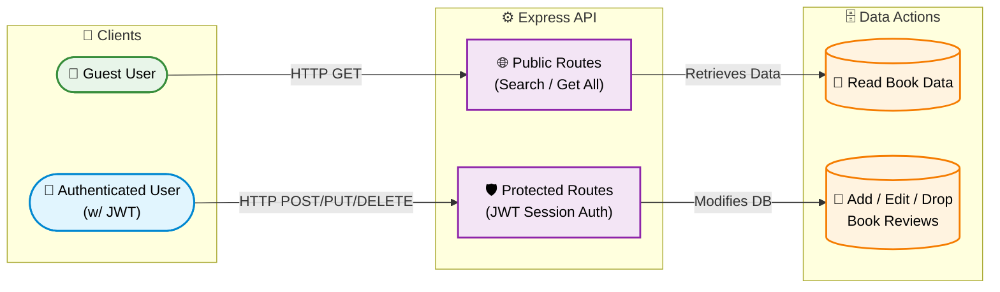
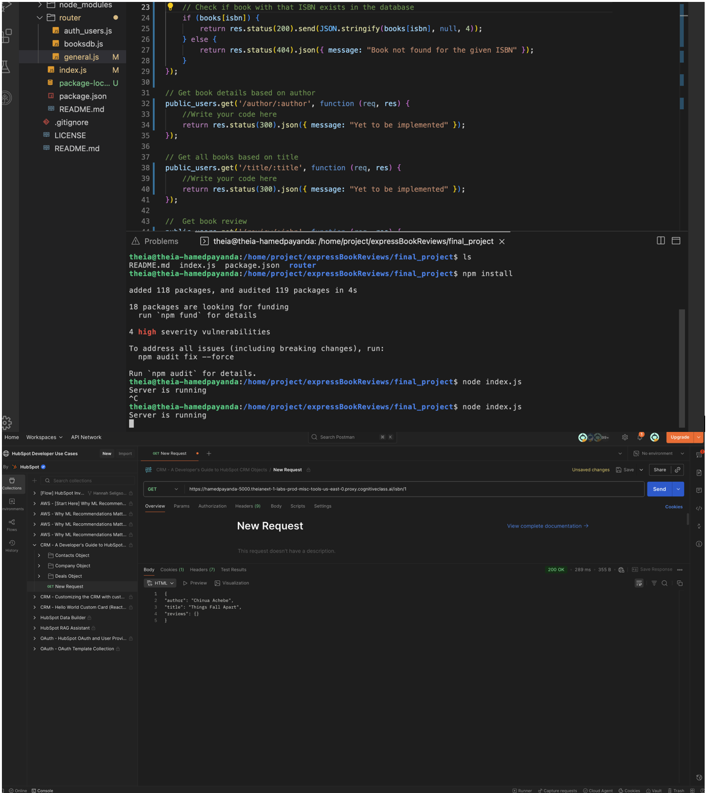
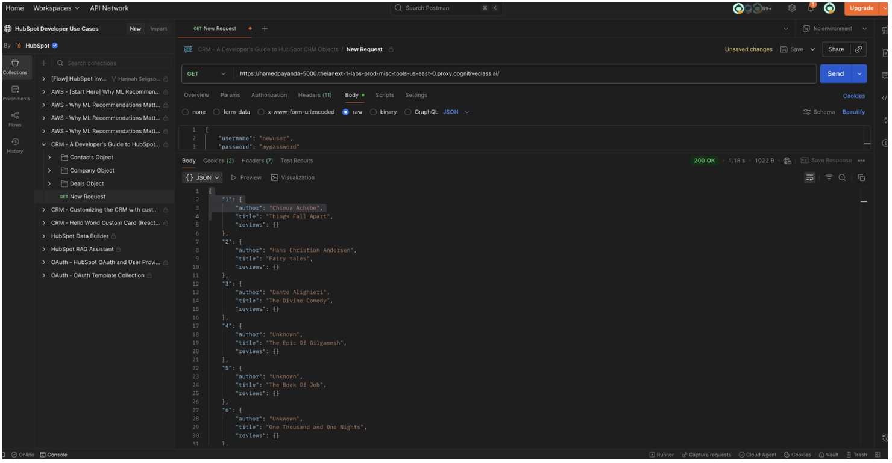

<div align="center">

# 📚 Express Book Review API

A server-side REST API built with Node.js and Express, featuring JWT-based authentication and asynchronous data fetching for managing an online book review application.

[](https://nodejs.org/)
[](https://expressjs.com/)
[](#)
[](https://jwt.io/)
<br>
[](https://www.coursera.org/professional-certificates/ibm-full-stack-cloud-developer)
[](#)


</div>

---

## 📌 Project Overview

This project is a robust server-side web application designed to manage an online book review platform. Built using **Node.js** and **Express.js**, the application exposes a secure REST API that allows users to register, authenticate via JSON Web Tokens (JWT), and interact with a database of books.

Developed as part of a Coursera lab, this repository heavily emphasizes modern JavaScript backend paradigms, specifically asynchronous programming utilizing **Promises** and **Async/Await** to ensure non-blocking HTTP request handling.

---

## 🏗️ API Workflow & Authentication

```text
┌───────────────┐       ┌────────────────────┐       ┌────────────────────┐
│               │       │   Public Routes    │       │                    │
│ Client / User │ ────> │ (Search / Get All) │ ────> │  Read Book Data    │
│               │       │                    │       │                    │
├───────────────┤       ├────────────────────┤       ├────────────────────┤
│               │       │  Protected Routes  │       │                    │
│ Authenticated │ ────> │ (JWT Session Auth) │ ────> │ Add / Edit / Drop  │
│ User (w/ JWT) │       │                    │       │   Book Reviews     │
└───────────────┘       └────────────────────┘       └────────────────────┘
```

---

✨ Key Features Implemented

•	User Authentication: Secure registration and login flows utilizing session-level JWT authentication.

•	Public REST Endpoints: Retrieve the complete catalog of books or perform targeted searches by ISBN, Author, or Title.

•	Protected REST Endpoints: Authenticated users can publish, modify, or permanently delete their own book reviews.

•	Asynchronous Operations: Fully implemented Promises and Async/Await architecture to simulate real-world database fetching.

•	Modular Routing: Clean separation of concerns between public access routes and authenticated-only routing.

---

## 🛠️ Core Tech Stack

| Category | Technologies Used | Purpose |
| :--- | :--- | :--- |
| **Backend Environment**| Node.js | Server runtime for executing JavaScript outside the browser |
| **Web Framework** | Express.js | Handling HTTP REST routing and middleware integration |
| **Authentication** | JSON Web Tokens (JWT)| Securing user sessions and protecting sensitive API endpoints |
| **Asynchronous Logic**| Promises, Async/Await | Handling non-blocking server operations and data retrieval |

---
## 📸 Visual Proof

The following screenshots demonstrate the server initialization and the successful validation of the REST API endpoints using Postman.

**1. Server Initialization & Route Testing (ISBN)**  
*This view captures the complete developer environment in the Cloud IDE. The terminal shows the successful installation of dependencies and the Express server running on the designated port. The Postman interface at the bottom verifies a successful `GET` request to retrieve a specific book's details using its ISBN.*


**2. Public API Catalog Retrieval**  
*Validating the primary public endpoint via Postman. The application successfully processes the `GET` request and returns an HTTP `200 OK` status along with the complete, correctly formatted JSON database of all available books.*


---

## 📁 Project Structure

```text
expressBookReviews/
├── final_project/             # Main application directory
│   ├── router/
│   │   ├── auth_users.js      # Protected routes requiring JWT (add/edit/delete reviews)
│   │   ├── general.js         # Public API routes (get books, search, register)
│   │   └── booksdb.js         # Mock database containing the book catalog
│   ├── index.js               # Application entry point, server, and middleware config
│   └── package.json           # Node.js dependencies and script commands
├── .DS_Store                  # macOS custom directory attributes
├── .gitignore                 # Specifies intentionally untracked files for Git
├── LICENSE                    # Project license (Apache 2.0)
├── README.md                  # Project documentation
├── screenshot1.png            # Visual proof: Server running & ISBN route test
└── screenshot2.png            # Visual proof: Public API catalog retrieval
```

---

## ⚙️ Local Setup & Execution

To test the API endpoints locally on your machine:
1. Clone the Repository
```text
git clone [https://github.com/HAMED-PAYANDA/expressBookReviews.git](https://github.com/HAMED-PAYANDA/expressBookReviews.git)
cd expressBookReviews/final_project
```

2. Install Dependencies
Ensure you have Node.js installed, then install the required Node modules:
```text
npm install
```

3. Run the Server
Launch the Node/Express server:
```text
npm start
# OR
node index.js
```

The server will initialize and begin listening for API requests on the designated local port.

---

## 📜 License

This project is licensed under the [Apache 2.0 License](LICENSE).

---

## 👤 Author

**Hamed Payanda**
* **GitHub:** [@HAMED-PAYANDA](https://github.com/HAMED-PAYANDA)
* Completed as part of the **IBM Full-Stack Software Developer Professional**.

